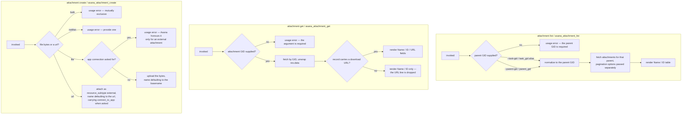

# attachments — the files hanging off a task, project, or project brief

## What

People drop files on Asana tasks: a screenshot of a bug, a signed contract, a spreadsheet of
numbers. Asana calls each one an **attachment**. An agent working a task usually needs to know two
things about them — *what is attached here?* and *where do I download that one?*

`attachments` answers those two questions, and lets a caller put a file there and take one away
again.

The shape of the capability is set by one fact about Asana: an attachment never stands alone. It
always hangs off a **parent object**, and you cannot ask for "all attachments" the way you can ask
for "all workspaces". So listing and attaching always need a parent identifier — a task, a project,
or a project brief. Reading or deleting a single attachment, by contrast, needs only the
attachment's own identifier, because at that point the parent is already known.

Asana's upload endpoint takes **either file bytes or an external URL**, never both, and the two
paths differ in more than their payload: an external attachment can additionally be **connected to
the calling app**, so Asana renders that app's components widget beside it. Asana honours that only
for an external attachment, and only under an OAuth token, so this node offers the option on the
URL path alone and rejects it on a file upload before any request is sent.

**Key terms**

- **GID** — Asana's global id for any object; an opaque string, never parsed or arithmetic.
- **Attachment** — a file record hanging off a parent object, carrying a name, a GID, and usually a
  download URL.
- **Parent object** — the Asana object an attachment belongs to: a task, a project, or a project
  brief. `--task-gid` stays a working alias for `--parent-gid`, because it predates the other two.
- **Download URL** — Asana's link to the file bytes. Asana does not always include it in a
  record, so this node treats it as optional rather than assumed.
- **External attachment** — an attachment that is a URL rather than uploaded bytes. Asana stores it
  with `resource_subtype: external`, which this node sets for the caller.
- **App connection** — Asana's `connect_to_app`, which links the authenticated app to an external
  attachment so its components widget renders. Requires an OAuth token.

**Non-goals.** This node does not offer an attachment **update**: Asana has no such endpoint. Nor
does it read an attachment's bytes — `get` hands back the download URL and stops there, because
fetching a signed URL is an ordinary HTTP GET the caller already has a tool for.

**What this node does not own.** How a paginated list behaves — bare array versus envelope, what
`--all` walks, where `--max-pages` stops — is the shared list contract in
[axi](../axi/README.md), adopted here rather than re-decided. Likewise `--json` / `--toon` output,
empty-state rendering, truncation, and exit-code conventions. This node's only pagination decision
is that `list` is paginated and `get` is not.

## Use Cases

**Subject** — reading the attachments on an Asana parent object, reading one attachment by GID, and
attaching or removing one, over the two surfaces (CLI and MCP) that share one `api.ts`.

| Entry point | Trigger | Inputs | Outcome |
|---|---|---|---|
| `attachment list` (CLI) | caller wants the files on a known parent object | the parent GID as `--parent-gid` (alias `--task-gid`), plus pagination options | the parent's attachments, rendered as a Name/ID table in text mode |
| `asana_attachment_list` (MCP) | agent wants the same over MCP | `parent_gid` (alias `task_gid`), plus the shared pagination params | the same result, JSON-serialized |
| `attachment get <gid>` (CLI) | caller holds an attachment GID and wants its record, usually for the download URL | the attachment GID, positionally | the unwrapped attachment record, rendered as Name/ID/URL fields in text mode |
| `asana_attachment_get` (MCP) | same, over MCP | `attachment_gid` only | the same record, JSON-serialized |
| `attachment create` (CLI) | caller wants a file or a link on a parent object | `--parent-gid <gid>`, either a file path positionally or `--url <url>`, optional `--name` and — on the URL path — `--connect-to-app` | the created attachment, rendered as Name/ID fields in text mode |
| `asana_attachment_create` (MCP) | same, over MCP | `parent_gid`, `file` or `url`, optional `name` and `connect_to_app` | the created attachment, JSON-serialized |
| `attachment delete` (CLI/MCP) | caller wants an attachment gone | the attachment GID | the shared idempotent delete record |

Both surfaces route through `api.ts` — neither `cli.ts` nor `mcp.ts` calls the Asana SDK directly,
so a change to what an attachment read means lands in one place.

## Logic

The two read groups share no decision, so they are drawn separately. The load-bearing edges:

- **The parent GID is required and is a flag, not a positional.** `list` and `create` cannot be
  called without it, and it is never defaulted from the environment. Only a *workspace* GID gets an environment
  default in this package; a task GID never does, because a wrongly-defaulted parent would return
  a plausible-looking list of the wrong task's files.
- **The `--task-gid` alias normalizes to the same parent GID.** It predates projects and project
  briefs as parents, so both spellings reach the same request and older invocations keep working.
- **The app connection is refused on the file path rather than dropped.** Asana ignores
  `connect_to_app` on an uploaded file, so accepting the flag there would be a surface that
  silently does nothing. It is a local usage error instead, and no request is sent.
- **The download URL is optional.** Asana omits it on some records. `get` treats a missing URL as
  an empty value rather than an error, and the text rendering then simply has no URL line. Name and
  GID are always there; the URL line appears only when there is a URL to show.

## Scenario map

### `attachment list` / `asana_attachment_list`

| Edge | Path (Given) | Scenario |
|---|---|---|
| parent GID supplied → fetch that object's attachments | a task carrying two attachments | `list returns the attachments of the task GID it was given` |
| legacy alias normalizes to the parent GID | the legacy task flag spelled instead of the current one | `list accepts the legacy task flag as the parent GID` |
| parent GID absent → usage error | no task GID on the invocation | `list without a task GID is a usage error` |
| no environment default for the parent GID (barred) | the workspace environment variable set, no task GID given | `list does not default its parent task GID from the environment` |
| pagination options travel beside the parent GID | a request carrying a page size and an offset token | `list sends its pagination options without disturbing the parent task GID` |
| render Name / ID table | text mode, two attachments | `list renders each attachment's name and GID in text mode` |

### `attachment get` / `asana_attachment_get`

| Edge | Path (Given) | Scenario |
|---|---|---|
| GID supplied → fetch | a GID naming an existing attachment | `get returns the attachment record for the GID it was given` |
| record carries a download URL → render it | text mode, an attachment whose record carries a download URL | `get renders the attachment's name, GID and download URL in text mode` |
| record omits the download URL → drop the URL line | text mode, an attachment whose record omits the download URL | `get omits the URL line when the record carries no download URL` |
| GID absent → usage error | no positional argument | `get without a GID is a usage error` |
| no pagination on a single-record read (barred) | any | `get offers no pagination options` |

### `attachment create` / `asana_attachment_create`

| Edge | Path (Given) | Scenario |
|---|---|---|
| url path carries the app connection | a parent GID, a url, and the app-connection flag | `create carries the app connection on a url attachment` |
| file path refuses the app connection | a parent GID, a file path, and the app-connection flag | `create refuses the app connection on a file upload` |
| app connection absent → no key in the request | a parent GID and a url with no app-connection flag | `create sends no app-connection key when the flag is absent` |

## References

- Asana API — [Attachments](https://developers.asana.com/reference/attachments) backs the upload
  request's shape: `file` and `url` are alternatives, `resource_subtype` is `asana` or `external`,
  and `connect_to_app` is "only relevant for external attachments with a parent task" and "can only
  be set if an OAuth token is used to authenticate the request".
