# skills — the shipped skill catalog and the contract every skill meets

## What

A **skill** is a folder of instructions an AI agent loads when a task matches it. `cyber-asana`
ships nine of them under `packages/cyber-asana/skills/`, and they are product: they sit on the
package's publish allowlist, every plugin manifest points at them, and for most users the skills are
the first thing the package does — the CLI and the MCP server are what the skills reach for.

The problem this node solves is that a skill is **read by a machine before a human ever sees it**.
An agent runtime scans every installed skill's front block, decides from one sentence whether this
skill is relevant, and only then reads the body. A skill that names itself something other than its
folder is not found. A description that never says *when* to use it is never chosen. A description
too long for the runtime's budget is cut, and the part that got cut is usually the trigger. None of
those failures is visible in the file — the skill looks fine and simply never fires.

So the nine skills share one **catalog contract**: the structural rules every skill in the folder
satisfies in order to be loadable, followable, discoverable, and shipped. This node owns that
contract. It is the thing that keeps nine skills, written months apart, from each inventing its own
answer to "what does a skill file look like".

**Key terms**

- **Skill** — one directory under `packages/cyber-asana/skills/`, holding a `SKILL.md` and
  optionally a `references/` folder.
- **`SKILL.md`** — the skill's entry file: a front block of fields, then the instructions.
- **Front block** — the `---`-fenced fields at the top of `SKILL.md`. `name` and `description` are
  the two the runtime reads to decide whether to load the skill.
- **Description budget** — the 120-character ceiling on `description`. Past it, agent runtimes
  truncate, and a cut description usually loses its trigger clause.
- **Trigger language** — the phrase in a description that says *when* the skill applies
  ("Use this skill when …"), as opposed to what it is about.
- **Reference** — a file under a skill's `references/`, named from the body, holding detail the
  agent loads only when it needs it.
- **Catalog** — all nine skills taken together, plus the two published tables that list them.
- **Publish allowlist** — `package.json`'s `files`. A path not on it never reaches the tarball.
- **`SETUP.md`** — the plugin root's setup instructions: what an agent reads once a plugin install
  has already wired the MCP server, covering only the credentials the install cannot supply. It is
  not a skill and does not live under `skills/`, but it is an instruction file an agent follows, so
  the contract holds it to the same bar — it must exist, ship, pin the commands it prescribes, and
  resolve every skill it hands off to.

**Non-goals.** This node does **not** specify what any individual skill tells an agent to do, nor
whether an agent given a real task actually engages the right skill, follows its steps, or produces
a good result. That is **agent behavior**, and it is measured by running an agent, not by reading a
file — so it belongs to the ACED evaluation suites, not here (see *What this node does not own*).
This node also does not own the Asana operations the skills call: those are the resource domain
nodes ([tasks](../tasks/README.md), [projects](../projects/README.md), and the rest).

**What this node does not own.** The split with **ACED** — the eval plugin for
agent-configuration artifacts — is the load-bearing boundary here, so state it plainly:

| Question | Answered by | Verified by |
|---|---|---|
| Is this skill loadable, followable, listed, and shipped? | **this node** | reading the files |
| Given a real task, does the agent engage this skill? | ACED | running an agent |
| Once engaged, does it follow its own steps? | ACED | running an agent |
| Is the result any good? | ACED | running an agent, graded |

The line is *what settles the question*. Everything this node freezes is settled by reading the
repository, which is why it can be a boolean suite. Everything ACED freezes needs a model in the
loop and a graded rubric. Each individual skill therefore gets a **reference node** here — a home
that names its subject and its trigger — and no suite of its own.

## Use Cases

**Subject** — the shipped skill catalog: the nine directories under
`packages/cyber-asana/skills/`, the plugin root's `SETUP.md` that hands off to them, the two
published tables that list them, and the packaging that carries them to a consumer. The contract is enforced in-repo by `src/skills/catalog.ts`, run from
`src/skills/catalog.test.ts`. There is **no CLI verb and no MCP tool**: the catalog is checked when
the repository is verified, not at runtime, because by the time a consumer has the package the files
are already fixed and a failing check would only report a defect they cannot fix.

| Entry point | Trigger | Inputs | Outcome |
|---|---|---|---|
| `collectCatalogViolations()` (exported) | `pnpm verify` runs, or a contributor adds or edits a skill | the skills directory, the repository root, the package manifest, and the universal plugin manifest | one violation record per broken rule, naming the skill and the rule; an empty list when the catalog holds |
| an agent runtime loading the plugin | a user's request may match an installed skill | each skill's `SKILL.md` front block | the skill is found by name and considered against its description |
| an agent following a loaded skill | the skill's body names `references/<file>` or a `cyber-asana` invocation | the skill directory's markdown | the referenced file resolves, and the invocation names an explicit version |
| a reader browsing the catalog | someone wants to know which skills exist | `readme.md` and the docs site's skills index | every shipped skill appears in both tables |
| `npm pack` / plugin install | the package is published or installed | `package.json` `files` and `.plugin/plugin.json` | the skills directory reaches the consumer, and the manifest points at it |

## Control Flow

```mermaid
graph TD
  subgraph load["loading a skill"]
    L0[a skill directory] --> L1{SKILL.md has a front block?}
    L1 -->|no| LBAD[violation: no front block]
    L1 -->|yes| L2{name equals the directory name?}
    L2 -->|no| LNAME[violation: name does not match]
    L2 -->|yes| L3{description present?}
    L3 -->|no| LMISS[violation: no description]
    L3 -->|yes| L4{description says when to use it?}
    L4 -->|no| LTRIG[violation: no trigger language]
    L4 -->|yes| L5{description within 120 characters?}
    L5 -->|no| LLONG[violation: over budget, with the count]
    L5 -->|yes| LOK[loadable]
  end

  subgraph refs["following a reference"]
    R0[the body names references/FILE] --> R1{that file exists in the skill directory?}
    R1 -->|no| RBAD[violation: reference does not resolve]
    R1 -->|yes| ROK[followable]
  end

  subgraph invoke["running a prescribed command"]
    I0[markdown anywhere under the skill] --> I1{an npx cyber-asana invocation?}
    I1 -->|no| IOK[nothing to pin]
    I1 -->|yes| I2{followed by an explicit @version?}
    I2 -->|no| IBAD[violation: unpinned invocation, naming the file]
    I2 -->|yes| IOK
  end

  subgraph list["discovering the catalog"]
    D0[a shipped skill] --> D1{named in readme.md?}
    D1 -->|no| DRM[violation: missing from the readme table]
    D1 -->|yes| D2{named in the docs site skills index?}
    D2 -->|no| DWEB[violation: missing from the docs table]
    D2 -->|yes| DOK[discoverable]
  end

  subgraph ship["publishing the catalog"]
    S0[the package is packed or installed] --> S1{skills on the publish allowlist?}
    S1 -->|no| SFILE[violation: the catalog does not ship]
    S1 -->|yes| S2{the manifest points at the shipped directory?}
    S2 -->|no| SMAN[violation: the manifest points elsewhere]
    S2 -->|yes| SOK[the catalog reaches the consumer]
  end
```

The load-bearing edges:

- **The name is checked against the directory, not against itself.** An agent runtime addresses a
  skill by its folder; the `name` field is what the skill calls itself. When they disagree the skill
  is unreachable under the name it advertises, and nothing in the file looks wrong. Checking one
  against the other is the only way that failure becomes visible.
- **Trigger language and length are two separate rules on one field, in that order.** A description
  can be perfectly phrased and still be cut; it can be short and still never say when it applies.
  Reporting them separately tells the author which of the two to fix.
- **The unpinned-invocation rule reads every markdown file under the skill, references included.**
  A version-pinned `npx cyber-asana@0.9.0` invocation is the point: an agent that runs a bare
  `npx cyber-asana` mid-workflow silently picks up whatever was published since. Detail that a skill
  pushed into `references/` is still detail an agent runs, so scanning only the top level would
  leave the deepest instructions unpinned.
- **Both published tables are checked, and named separately.** The readme and the docs site are
  different audiences reached by different paths. A skill listed in one and not the other is not
  half-discoverable; it is invisible to whoever uses the other door.
- **Publishing is checked because the failure is silent and total.** `files` and the manifest are
  two lines of configuration, and if either is wrong the nine skills are perfect and absent. Nothing
  else in the repository notices — every test still passes against files that never shipped.

## Scenario map

### loading a skill

| Edge | Path (Given) | Scenario |
|---|---|---|
| front block present → keep checking | a skill whose front block declares its own directory name | `a skill whose declared name matches its directory is accepted` |
| no front block → violation | a SKILL.md whose first line is a heading | `a SKILL.md with no front block is rejected by skill name` |
| name differs → violation | a skill whose front block declares a different name | `a skill whose declared name differs from its directory is rejected` |
| description absent → violation | a front block carrying a name and nothing else | `a skill with no description is rejected by skill name` |
| trigger language present → accepted | a description opening with "Use this skill when" | `a description that says when the skill applies is accepted` |
| no trigger language → violation | a description that states only the skill's topic | `a description that never says when to use the skill is rejected` |
| within budget → accepted | a description of exactly 120 characters | `a description at the 120-character budget is accepted` |
| over budget → violation | a description of 121 characters | `a description over the budget is rejected with its character count` |

### following a reference

| Edge | Path (Given) | Scenario |
|---|---|---|
| the reference resolves → accepted | a skill naming `references/templates.md`, which it ships | `a reference the skill ships is accepted` |
| the reference is missing → violation | a skill naming `references/templates.md`, with no references directory | `a reference the skill names but does not ship is rejected by file name` |

### running a prescribed command

| Edge | Path (Given) | Scenario |
|---|---|---|
| pinned → accepted | a SKILL.md invoking `npx cyber-asana@0.9.0 task list` | `an invocation pinned to a version is accepted` |
| unpinned → violation | a SKILL.md invoking `npx cyber-asana task list` | `an unpinned invocation is rejected by file name` |
| unpinned in a reference → violation | a reference file invoking `npx --yes cyber-asana task list` | `an unpinned invocation inside a reference file is rejected by file name` |

### discovering the catalog

| Edge | Path (Given) | Scenario |
|---|---|---|
| named in both tables → accepted | a skill named in the readme table and in the docs site index | `a skill listed in both published tables is accepted` |
| absent from the readme → violation | a skill named in the docs site index only | `a skill missing from the readme table is rejected naming the readme` |
| absent from the docs site → violation | a skill named in the readme table only | `a skill missing from the docs site index is rejected naming that page` |

### publishing the catalog

| Edge | Path (Given) | Scenario |
|---|---|---|
| allowlisted → the catalog ships | a package manifest whose files list carries `skills` | `a skills directory on the publish allowlist is accepted` |
| not allowlisted → violation | a package manifest whose files list carries only `dist` | `a skills directory absent from the publish allowlist is rejected` |
| the manifest points at it → accepted | a plugin manifest whose skills field is `./skills/` | `a plugin manifest pointing at the shipped directory is accepted` |
| the manifest points elsewhere → violation | a plugin manifest whose skills field is `./agent-skills/` | `a plugin manifest pointing away from the shipped directory is rejected` |

## References

- [Agent Plugins 1.0.0](https://github.com/agentplugins/agent-plugins-spec) — backs the claim that
  skills are read from a **fixed location** (`skills/<name>/SKILL.md`) rather than declared inline
  in the manifest, which is why the directory name is load-bearing and why a manifest pointing
  elsewhere breaks discovery rather than relocating it.
